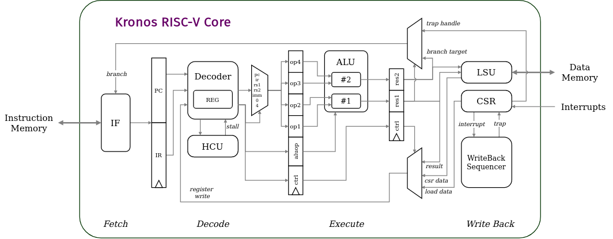

# Kronos Architecture

Like every other processor designer out there, I designed the the Kronos core with the express objective to maximize performance while using the least resources. In other words, raw performance at a reasonable cost, with a priority on performance. The challenging constraint inspired some interesting design choices which are described in subsequent sections. Most implemented instructions executed in one cycle.

The design was developed on the [iCEBreaker](https://1bitsquared.com/products/icebreaker) FPGA Development board which houses the tiny Lattice iCE40U5K, to showcase its viability as a performance core for low-end embedded FPGA systems.

Kronos is 4-stage pipelined in-order RISC-V core. The RISC-V ISA is well suited to be implemented as a classic pipelined risc architecture, and this core is no exception. An overview of the kronos core is illustrated below, visualizing the four stages.

## Fetch

The instruction fetch stage reads word-aligned (4B) 32-bit instructions over a simple `req`/`gnt` style synchronous interface, designed to play well with synchronous single-port SRAM. The Program Counter (`PC`) is 32b wide as per RV32I spec (`XLEN = 32`). Under ideal circumstances an instruction is fetched every cycle, offering ideal throughput. The `PC` always increments to the next word (`PC+4`) unless the core needs to jump as a result of an instruction or to the trap handler.

## Decode

The instruction (`IR`) from the Fetch stage is decoded into four operands (`op1-4`) and control signals (say, ALU controls) for the next stages. The 32 RISC-V Integer registers reside in the Decoder and register operands (`rs1`, `rs2`) are read when needed. Structural hazard checks are maintained by a dedicated and quite simple Hazard Control Unit (`HCU`) and it stalls the Decoder when a register operand that is to be read has a pending write. The Decode stage ensures that operands passed to the next stage are always hazard free. The stage takes one cycle unless stalled by the HCU.

## Execute

The Kronos Execute stage contains an handcrafted `ALU` (Arithmetic Logic Unit) with two tracks (primary and secondary). The primary track calculated `result1` from `op1` and `op2` as per the alu operation decoded. The secondary tracks generates `result2` from `op3` and `op4`. Most instructions use one track (the primary one). Write back controls are simply forwarded to the next next stage.

## Write Back

The final stage of the Kronos core is responsible for quite a bit of work. Aside from writing back results to the integer registers, and branching conditionally or not, it also sequences memory access operations (data load/store) and Control-Status Register (`CSR`) operations. And, catches exceptions and responds to interrupts. Register write backs can be either the result of an instruction, some data loaded from the memory, or data read from the CSR. When a branch occurs, the entire pipeline is flushed.
