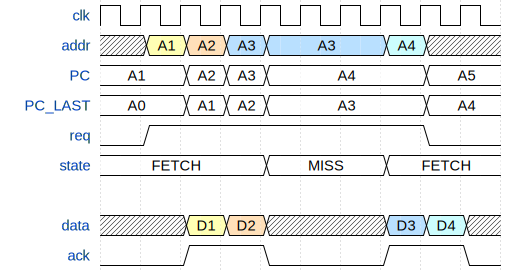
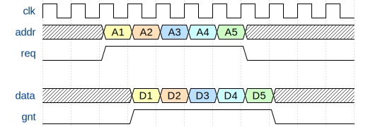
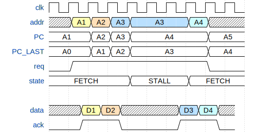
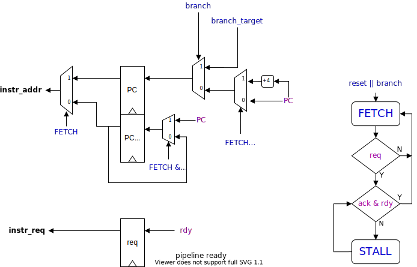

# Instruction Fetch

The Fetch stage is the feed belt to the processor. The stage needs to fetch instructions as fast as possible because the feed rate will critically decide the performance of the core. The Kronos core is designed to target a single-cycle execution rate, and the thus, the Fetch stage needs to be able to read an instruction from the memory at th same rate.

I designed the fetch stage to interface with synchronous SRAM, where you set the `read address` and the `read data` is valid one cycle later. Technically, this read is a two-cycle operation. The `req` and `gnt` act as access control signals can be mapped to popular bus standards or even wired directly to SRAM (the iCE40UP5K has 128KB of single port synchronous SRAM).

To read from the SRAM every cycle, the next read request (alongside address) needs to overlap the read grant (and data) from the previous request. The Fetch stage attempts to read the next address while waiting on the grant from the current read. This maximizes throughput, and is one of the simplest memory prefetch techniques called One Block Look-Ahead (OBL) is often used for cache read optimization.

The above waveform is ideal. In case of a delayed grant (cache miss or arbitration loss) or pipeline stall, the Fetch stage needs to be clever enough to re-sequence the reads. When the grant is delayed, the Fetch stage needs to revert its request to the current address seamlessly.

All of the above control logic can be boiled down to a simple 3-state FSM.

In the above illustration, the `rdy` signal indicates when the pipeline is ready for the next instruction. It is low when the pipeline is stalling. There is no need to read from the memory when the pipeline can't consume any new instructions. The control waits in STALL when stalling or when a fetch **misses** (`gnt` doesn't appear right after a `req`). The FETCH state updates the PC regardless of `gnt`, while storing a copy of the current PC. The previous PC is used to drive the read address when not in steady throughput. Lastly, when the core branches, the cycle needs to restart.
