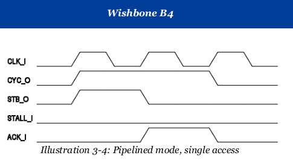

# Kronos Core Integration

All of the HDL for the Kronos core is located in the [rtl/core](https://github.com/SonalPinto/kronos/tree/master/rtl/core) directory, with the top design file being [`kronos_core.sv`](https://github.com/SonalPinto/kronos/blob/master/rtl/core/kronos_core.sv). An instantiation template is provided below.

```
logic clk, rstz;

// Instruction memory interface
logic [31:0] instr_addr;
logic [31:0] instr_data;
logic instr_req;
logic instr_ack;

// Data memory interface
logic [31:0] data_addr;
logic [31:0] data_rd_data;
logic [31:0] data_wr_data;
logic [3:0] data_mask;
logic data_wr_en;
logic data_req;
logic data_ack;

// Interrupt Sources
logic software_interrupt;
logic timer_interrupt;
logic external_interrupt;

kronos_core #(
  .BOOT_ADDR            (32'h0),
  .FAST_BRANCH          (1    ),
  .EN_COUNTERS          (1    ),
  .EN_COUNTERS64B       (0    ),
  .CATCH_ILLEGAL_INSTR  (1    ),
  .CATCH_MISALIGNED_JMP (1    ),
  .CATCH_MISALIGNED_LDST(1    )
) u_core (
    .clk               (clk               ),
    .rstz              (rstz              ),
    .instr_addr        (instr_addr        ),
    .instr_data        (instr_data        ),
    .instr_req         (instr_req         ),
    .instr_ack         (instr_ack         ),
    .data_addr         (data_addr         ),
    .data_rd_data      (data_rd_data      ),
    .data_wr_data      (data_wr_data      ),
    .data_mask         (data_mask         ),
    .data_wr_en        (data_wr_en        ),
    .data_req          (data_req          ),
    .data_ack          (data_ack          ),
    .software_interrupt(software_interrupt),
    .timer_interrupt   (timer_interrupt   ),
    .external_interrupt(external_interrupt)
);
```

The Kronos core is a dual **Wishbone** pipelined master. Reference: [Wishbone B4 specification](https://cdn.opencores.org/downloads/wbspec_b4.pdf), section 3.1.3.2.



## Configuration

| Parameter | Description |
|-----------|-------------|
| BOOT_ADDR | First address fetched by the IF stage |
| FAST_BRANCH | Branch operations take 2 cycle using forwarding, instead of 3 |
| EN_COUNTERS | Instantiate HPM counters mcycle and minstret |
| EN_COUNTERS64B | Instantiate the counters as 64b |
| CATCH_ILLEGAL_INSTR | Catch illegal instruction exception |
| CATCH_MISALIGNED_JMP |  Catch misaligned jump exception |
| CATCH_MISALIGNED_LDST | Catch misaligned load and store exceptions |


## Clocking and Reset
`clk` decides the rate of instruction execution and is the heartbeat of the core. The `rstz` signal resets the entire core, and is an asynchronous reset, and may require de-assert synchronization outside the core.

| Signal     | Direction | Width | WISHBONE Equivalent
|------------|-----------|-------|--------------------
| clk        | in        | 1     | CLK_I
| rstz       | in        | 1     | RST_I, inverted

You may not want to drive `rstz` with RST_I, if signal is only intended to reset the bus to in your platform.


## Instruction Memory Interface

The Fetch stage of the Kronos core interacts with a 32-bit wide byte-addressable Instruction memory.

| Signal     | Direction | Width | WISHBONE Equivalent
|------------|-----------|-------|--------------------
| instr_addr | out       | 32    | ADR_O
| instr_data | in        | 32    | DAT_I
| instr_req  | out       | 1     | STB_O
| instr_ack  | in        | 1     | ACK_I

Since, the Fetch stage only reads, the WE_O can be tied low and the SEL_O should select the entire word. Also, stage does not generate wait states, and thus every request is a unique SINGLE READ bus cycle. The read data is expected to be valid on the next cycle (or eventually in case of a miss) after address and request is asserted. This is great for synchronous SRAM (in FPGA) which has a clocked read. The Fetch stage was [designed](instr_fetch.md) to handle this.

The `instr_addr` is word aligned, i.e. `instr_addr[1:0] == 0b00`


## Data Memory Interface

The LSU (Load Store Unit) in the Execute stage is also designed to work with a 32-bit wide byte-addressable Data memory. Upon asserting the `data_req`, the `data_ack` is expected to be high on the subsequent cycle, or eventually whenever the request is completed.

| Signal     | Direction | Width | WISHBONE Equivalent
|------------|-----------|-------|--------------------
| data_addr  | out       | 32    | ADR_O
| data_rd_data| in       | 32    | DAT_I
| data_wr_data| out      | 32    | DAT_O
| data_wr_en | out       | 1     | WE_O
| data_mask  | out       | 4     | SEL_O
| data_req   | out       | 1     | STB_O
| data_ack   | in        | 1     | ACK_I

The `data_mask` is an active-high 4-bit byte-level mask. The high bits indicate the position of the data bytes that should be read/written over on the word.

The `data_addr` is word aligned, i.e. `data_addr[1:0] == 0b00`

## Interrupt Sources

These are machine-level interrupts defined in the RISC-V spec. They are active high, and the core expects these to be registered and remain high, until addressed. 

| Signal     | Direction | Width 
|------------|-----------|-------
| software_interrupt   | in        | 1
| timer_interrupt   | in       | 1
| external_interrupt   | in        | 1

The timer interrupt needs a memory mapped RISC-V registers `mtime` and `mtimecmp`. The software interrupt could also be similarly a memory mapped register. The external interrupt is the aggregate of all other interrupts in the platform, usually the output of a PLIC (Platform Level Interrupt Controller).
