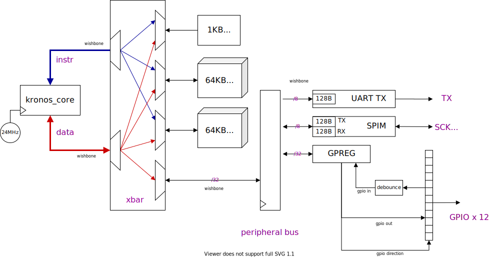

# KRZ SoC

Kronos Zero Degree (KRZ) is the System-on-Chip packaged in this project to show-off the Kronos core. It is designed for the iCE40UP5K with the following features.

  - 128KB of RAM as 2 contiguous banks of 64KB.
  - 1KB Bootrom for loading program from flash to RAM.
  - UART TX with 128B buffer.
      - Configurable baud rate
  - SPI Master with 256B RX/TX buffers.
      - Configurable SPI Mode and rate.
      - Max 12MHz.
  - 12 Bidirectional configurable GPIO.
      - Debounced inputs.
  - 32-bit General Purpose registers



The bootrom, and two 64KB banks of main memory are individually arbitrated. The Kronos Instruction Bus and Data Bus can access different parts of the memory simultaneously without halting each other. They can access the entire memory, and only need to be arbitrated if they are accessing the same
section.

But, usually, most of the code should be run from bank0, while frequent data like the stack will be in bank1. In a design without cache, this setup will lead to optimal performance.


## Memory Map

Address | Section
--------|----------
0x000000 - 0x000400 | 1KB Boot ROM
0x010000 - 0x02ffff | 128KB RAM (split into two individually accessible 64KB banks)
0x800000 | Scratch
0x800004 | Bootvec
0x800008 | GPIO Direction
0x80000C | GPIO Write value
0x800010 | GPIO Read value
0x800014 | UART Control
0x800018 | UART Status
0x80001C | SPIM Control
0x800020 | SPIM Status
0x800100 | UART TX
0x800200 | SPIM RX/TX

###### Scratch

32b general purpose register. Get creative with it.

###### Bootvec

The Bootvec register can be used for runtime warmboot. The application can write an address (in the flash) into the `bootvec` and jump to the bootrom start address (0x000000).

###### GPIO

12-bit General Purpose IO controls. GPIO Direction (0=Read - default, 1=Write) sets the config for the bidirectional GPIO. The read value is debounced in hardware to make life just that much easier.

###### UART

The UART Control register is used to set the 12-b prescaler, and can clear the TX queue on demand.

```
baud rate (default 115200) = clk/(prescaler+1)

 12         11         0       bit
+----------+-----------+
| tx clear | prescaler |       UART_CTRL
+----------+-----------+

 7         0                   bit
+----------+
| TXQ size |                   UART_STATUS
+----------+

``` 
The UART Status reports the current TX queue size (8-bit). Write to the UART peripheral at the UART TX address, `0x800100`. The access should be byte-wide.


###### SPIM

The SPI Master Control register is used to set the 8-b prescaler and SPI Mode (CPOL, CPHA). As well as clearing the RX/TX Queues. The SPI Master status register reports the queue sizes

```
SPI clock rate = clk/(2 * prescaler+1)


 11         10         9      8      7          0       bit
+----------+----------+------+------+-----------+
| rx clear | tx clear | cpha | cpol | prescaler |       SPIM_CTRL
+----------+----------+------+------+-----------+

 15         7         0                                 bit
+----------+----------+
| RXQ size | TXQ size |                                 SPIM_STATUS
+----------+----------+

``` 

Read/Write to the SPIM peripheral at the SPIM address, `0x800200`. The access should be byte-wide.

## Build using Radiant

From the root of the kronos project, build the project for release. This does require having the riscv toolchain in your PATH.

```
mkdir build
cd build
cmake ..

```

Next, build the bootloader program.

```
make riscv-krz_bootloader     # generates output/data/krz_bootloader.mem

```

When building the project, a run script for [Lattice Radiant](http://www.latticesemi.com/Products/DesignSoftwareAndIP/FPGAandLDS/Radiant) is configured. There should be a script per platform in the `output/radiant` directory. In this example, I am building for the `iCEBreaker`. Launch Radiant with it and go through the implementation flow, and export the gateware.

```
radiant -t output/radiant/krz_icebreaker/build_krz.tcl

```
Look for the `FX276` messages in the synthesis log to ensure that the BRAMs are properly initialized with the compiled bootloader.

Finally flash the iCEBreaker using [iceprog](https://github.com/cliffordwolf/icestorm/tree/master/iceprog).

```
iceprog output/radiant/krz_icebreaker/krz_impl/krz_icebreaker_krz_impl.bin

```

## Flashing Programs

The KRZ can boot any program from the attached flash (as long as it fits within the 128KB RAM). The project already comes a demo program for the iCEBreaker - [krz_blinky](https://github.com/SonalPinto/kronos/tree/master/src/krz) - which interfaces with the 3 button + 5 LED PMOD that comes default with every iCEBreaker board.

> [Linker Script](https://github.com/SonalPinto/kronos/blob/master/src/krz/link.ld)

Build app. The compiled binary is prepended with the program size with a tiny python script ([krz_prog](https://github.com/SonalPinto/kronos/blob/master/utils/krzprog.py)) to get the flashable image. So, if you build your own code, use `krz_prog` to process it.
```
> make krz-riscv-krz_blinky

processing /home/sonal/work/kronos/build/output/data/krz_blinky.bin
program size: 2064 bytes
Ready to Flash: /home/sonal/work/kronos/build/output/data/krz_blinky.krz.bin

```

Finally, use iceprog to burn the flash with the application. The default flashboot vector is at `0x00100000`.

```
iceprog -o 1M output/data/krz_blinky.krz.bin

```

And that's it! Open a terminal on the second channel on the iCEBreaker's FTDI (I use pyterm) to see the prints. 

```
 ____  __.                                  
|    |/ _|______  ____   ____   ____  ______
|      < \_  __ \/  _ \ /    \ /  _ \/  ___/
|    |  \ |  | \(  <_> )   |  (  <_> )___ \ 
|____|__ \|__|   \____/|___|  /\____/____  >
        \/                  \/           \/ 

BTN[0][0][0]
BTN[0][0][0]
BTN[0][0][0]

```
