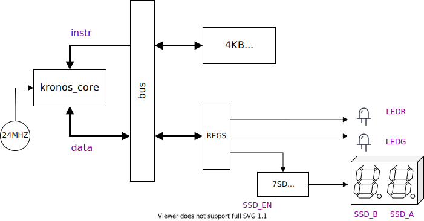

# Snowflake

Snowflake is a small demo SoC (for the iCEBreaker) that I had written to quickly prove that the Kronos core is viable. It only has a small 4KB memory (EBR), two LED outputs and a 7-segment two character driver (for interfacing with this [PMOD](https://1bitsquared.com/collections/fpga/products/pmod-7-segment-display) that came along with my iCEBreaker kit).



## Memory Map

Address | Section
--------|----------
0x0000 - 0x1000 | 4KB Main Memory
0x1000| LEDR
0x1004| LEDG
0x1008| 7SD_EN
0x100C| 7SD_A
0x1010| 7SD_B

## Build Using Radiant

From the root of the kronos project, build the project for release. This does require having the riscv toolchain and srec_cat in your PATH.

```
mkdir build
cd build
cmake ..

```

The snowflake demo soc has the compiled source in the embedded block ram. The platform needs to be compiled with a verilog define,  `PROGRAM=<path to verilog memory file>`.

Currently, there are two [demo programs](https://github.com/SonalPinto/kronos/tree/master/src/snowflake), and they can be built with these targets.
```
make riscv-sf_blinky  # generate ./output/data/sf_prime.mem
make riscv-sf_prime   # generate ./output/data/sf_blinky.mem

```

You can also find the bin and objdump for these programs in the same output directory.

A [Lattice Radiant](http://www.latticesemi.com/Products/DesignSoftwareAndIP/FPGAandLDS/Radiant) build script is configured for building snowflake with the `sf_prime` program. You can edit the script to point to any other compiled mem file. Launch Radiant with it and go through the implementation flow, and export the gateware.

```
radiant -t output/radiant/sf_icebreaker/build_sf.tcl

```

Look for the `FX276` messages in the synthesis log to ensure that the BRAMs are properly initialized with the compiled program.

Finally flash the iCEBreaker using [iceprog](https://github.com/cliffordwolf/icestorm/tree/master/iceprog).

```
iceprog ./output/radiant/sf_icebreaker/sf_impl/sf_icebreaker_sf_impl.bin

```
