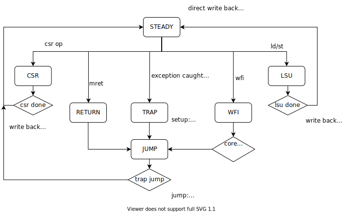

# Write Back

The Write Back stage which you have been reading so much about in the previous sections wraps the LSU and CSR. It also has logic for direct register writes, branching, catching exceptions and acting upon them. There's a control sequencer which manages all of them, upon receiving the results from the Execute stage.

#### Register Write Back

The integer registers can be written back by these sources:
- Direct Write (`result1`), as a result of an instruction execution
- Load Data, as instructed by the LSU executing a load instruction
- CSR Read Data, as required by CSR system instructions

Direct writes are committed in the same cycle as execute results go valid and no exceptions are caught or interrupts are pending, i.e. the STEADY state. This is a zero-cycle operation.

Loads take 2 to 3 cycles (for immediate memory) depending on whether the access required a boundary cross read. This will be longer for far memory, i.e memory mapped registers, flash, etc. CSR read data write back is only committed after the entire sequence of read/modify/write on the CSR have concluded, which takes 3 to 4 cycles (almost always 3, unless you read the hpmcounter's upper word with a pending tick).

#### Branching

The direct branch target is in `resutl2`. For unconditional jumps, the core branches right away. For conditional jumps, the LSB of the `result1` is checked first, and if its high, the jump is triggered. As with direct writes, the direct jumps only go through if not exceptions are caught or interrupts are pending, and is a zero-cycle operation.

The core also branches when jumping to or returning from a trap, as shown in state JUMP.

#### Trapping

When the execute results are driven in, the Write back stage checks for immediate exceptions. These are:
- Illegal instruction
- Instruction address misaligned

If immediate exceptions are caught or if there's a pending interrupt, the the direct write and direct branching is blocked, and the core activates the trap.

Non-immediate traps like system instructions (ECALL, EBREAK) have their exception setup and then processed.
